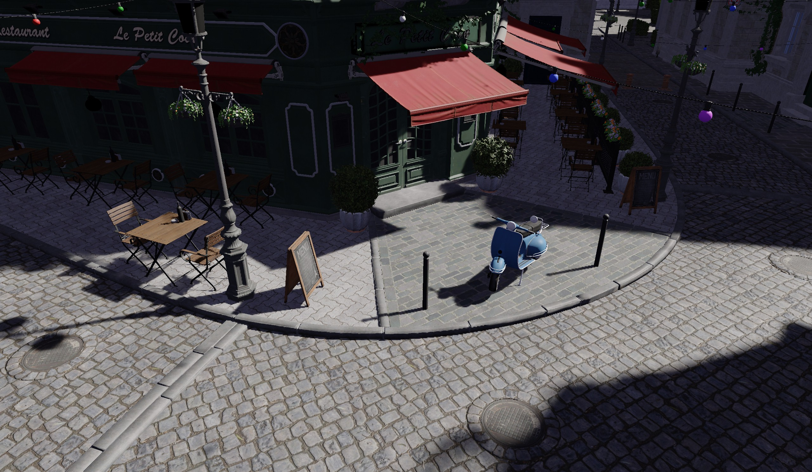
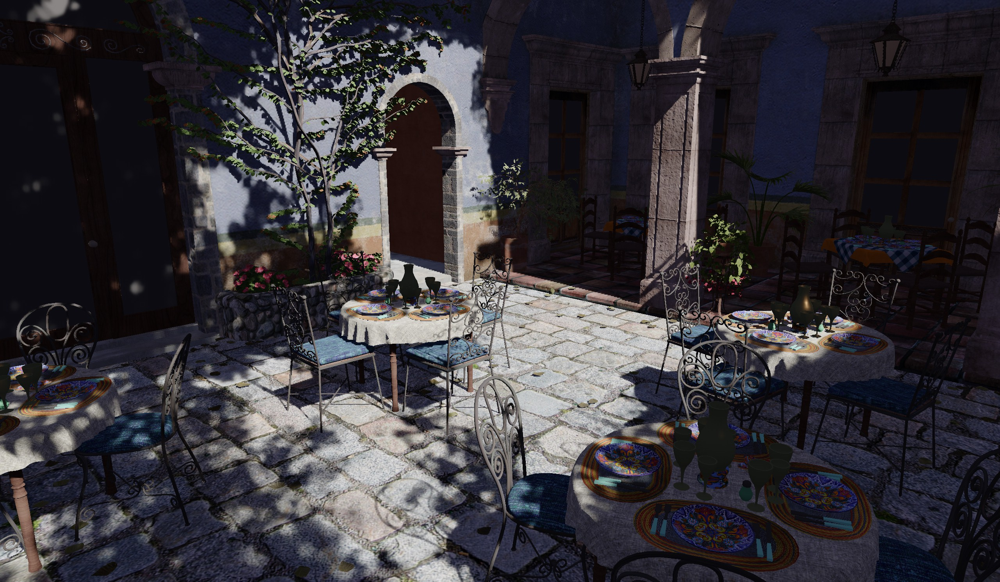

# Vulkan RT

Personal experimental vulkan ray-tracing project. Currently WIP.

## Features

- Supports glTF model
- Indirect rendering with GPU frustum culling
- Deferred rendering, PBR supported
- Fine-tuned auto exposure, prioritizes bright areas
- Raytraced soft-shadow

## Gallery

### Bistro

> - **Commit**: `fb177c4291a5ee4b75be4f2cc778e8c475881149`
> - Captured using RenderDoc, excluding UI
> - **Source**: https://developer.nvidia.com/orca/amazon-lumberyard-bistro, converted to glTF using Blender

### San Miguel

> - **Commit**: `fb177c4291a5ee4b75be4f2cc778e8c475881149`
> - Captured using RenderDoc, excluding UI
> - **Source**: glTF model from Bevy Discord server

## Requirements

> [!Note]
> Developer's hardware and environment setup:
>
> - **OS**: Debian GNU/Linux testing
> - **GPU**: Nvidia RTX 4060 Laptop

### Running

**OS**:

- Windows 11 or newer
- Linux with adequate Vulkan support (See below)

**GPU**:

- Supports Vulkan 1.4+
- Supports Vulkan hardware raytracing
- See [`context.hpp`](vulkan/interface/include/vulkan/interface/context.hpp) for detailed requirements

### Building

In addition to requirements for running:

- Xmake build system ([Installation Guide](https://xmake.io/guide/quick-start.html#installation))
- Slang Compiler 2026.8+ ([Download Link](https://github.com/shader-slang/slang/releases))
- Clang-format >= 22
- C++23 compatible compiler
    - Known to work:
        - GCC >= 15
        - MSVC >= 14.51
    - Known to not work:
        - Clang <= 22 (lacks `views::chunk`/`views::slide` support)
