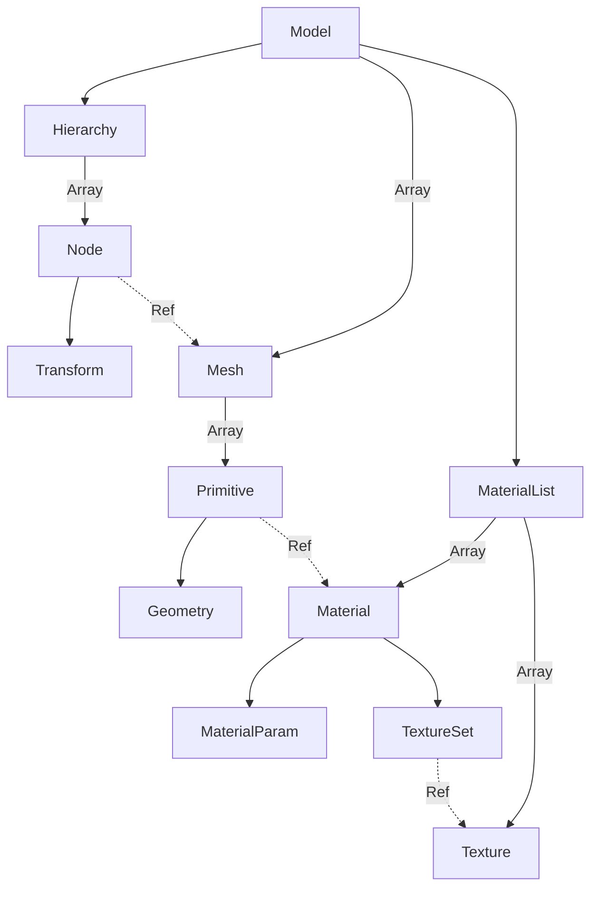

# CPU Model

## Overview

Refer to the docs in the headers for more detailed descriptions

## Texture

A texture (`model::Texture`) is a generic container for image data and how it should be sampled. It allows data to be fetched and loaded in different ways: from a file, from a range of encoded image data, and from decoded image data.

## Texture Set

A texture set `model::TextureSet` is a set of optional references to textures for use in materials. Currently the set contains:

- Albedo/Diffuse/Color texture: the texture used as the primary color for a material
- Normal map texture: the texture used as the normal map for a material
- ORM texture: full name being "Occlusion-roughness-metallic texture", serves as the PBR texture. The occlusion channel is not used, only for compatibility purpose.
- Emissive texture: the texture describing the emissivity (the ability for a material to emit light by itself without external lights)

All references are optional. When absent, a fixed fallback is provided.

## Material Parameters

Material parameters describes numeric parameters of a material, for example, color multipliers, effect strengths.

The material parameters mostly uses the same fields as glTF 2.0, with exceptions of:

- Occlusion strength: since this project aims to build a ray-tracing renderer, occlusions are actually omitted.
- Normal strength: normal strength in glTF is a scalar value, but here normal strength is a `float2` value. By setting the normal strength to negative value, the axis can be flipped without modifying the texture

## Material

A material is a pair of material parameters and a texture set. Identical to the concept of glTF materials. Noticably, current definition of material only allows a single texture-coordinate for addressing the textures.

## Geometry

A geometry contains only raw vertices and indices for a primitive.

## Primitive

A primitive is a pair of geometry, and the material used for rendering the geometry.

## Mesh

A mesh consists of one or more primitives. Like in glTF, it serves the sole purpose of reusing mesh data across different nodes.

## Node & Hierarchy

Hierarchy and its nodes are the actual data that defines how objects should be placed in the scene.

Like in glTF, a node (except the root node) has a parent node and stores a transform relative to is parent. Additionally, it optionally contains a reference to a mesh, when such reference exists, it is a _renderable_ node.

Different to that in glTF, the hierarchy only allows a single root node (for now). When parsing a model/format with multiple root nodes, create a virtual root node that takes the original root nodes as its child.
